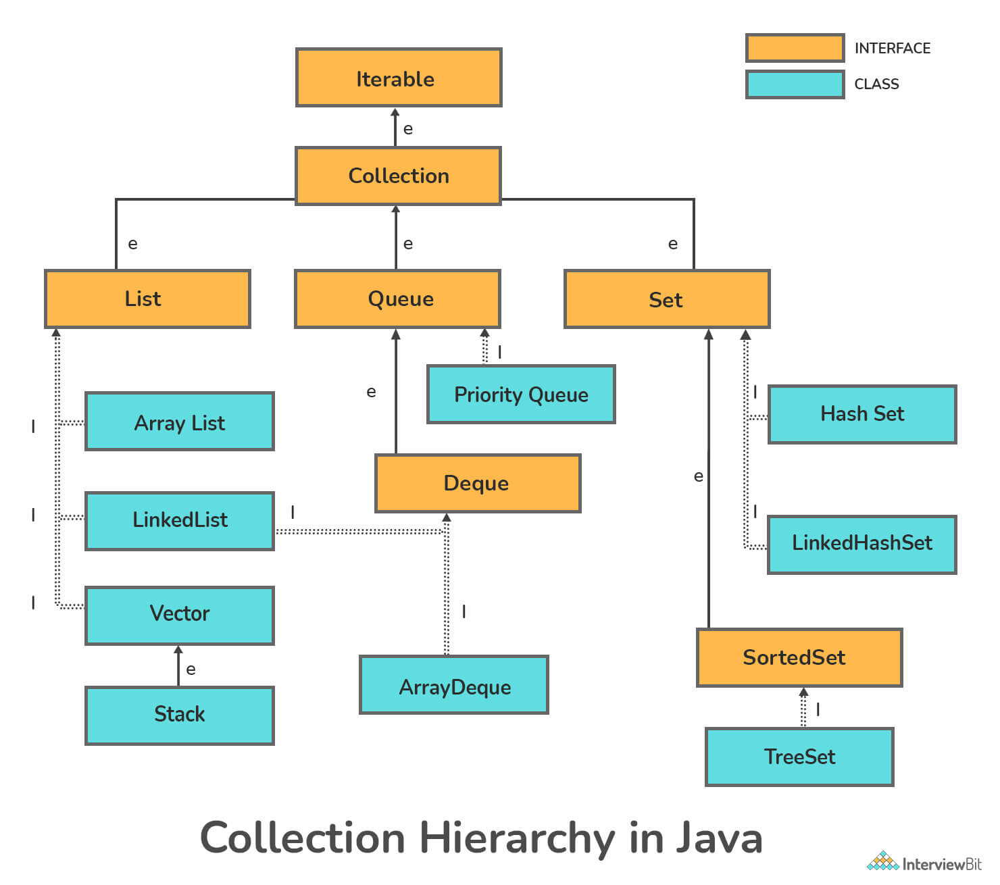
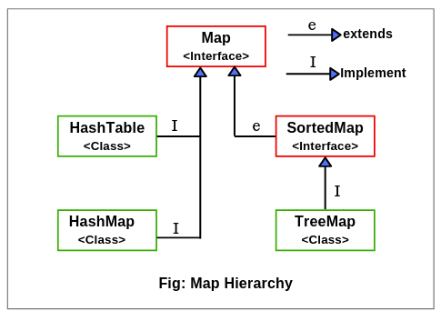

# Collections

## Difference Collection and collections in the context of Java

| Collection                                                                                                                                                                               | Collections                                                                                                                      |
| ------------------------------------------------------------------------------------------------------------------------------------------------------------------------------------------ | ---------------------------------------------------------------------------------------------------------------------------------- |
| Collection is a interface present in java.util.package                                                                                                                                   | Collections is a utility class present in java.util.package                                                                      |
| The collection is considered as the root interface of the collection framework. It provides several classes and interfaces to represent a group of individual objects as a single unit. | It defines several utility methods like sorting and searching which is used to operate on collection. It has all static methods. |
| Since Java 8, the Collection is an interface with a static function. Abstract and default methods can also be found in the Interface.                                                   | It only has static methods in it.                                                                                                |

## Hierarchy of the Collection framework

The entire collection framework hierarchy is made up of four fundamental interfaces: Collection, List, Set, Map, and two specific interfaces for sorting called SortedSet and SortedMap.

The java.util package contains all of the collection framework's interfaces and classes. The following diagram depicts the Java collection structure.

Here, e denotes extends, i denotes implements

### Iterator and ListIterator

| Iterator                                                                        | ListIterator                                                                                   |
| --------------------------------------------------------------------------------- | ------------------------------------------------------------------------------------------------ |
| The Iterator traverses the elements in the forward direction only.              | ListIterator traverses the elements in backward and forward directions both.                   |
| The Iterator can be used in List, Set, and Queue.                               | ListIterator can be used in List only.                                                         |
| The Iterator can only perform remove operation while traversing the collection. | ListIterator can perform ?add,? ?remove,? and ?set? operation while traversing the collection. |

## List

1. Elements are arranged sequentially ordered.
2. List maintains an order of elements means the order is retained in which we add elements, and the same sequence we will get while retrieving elements.
3. We can insert elements into the list at any location.
4. The list allows storing duplicate elements in Java.
5. ArrayList, vector, and LinkedList are three concrete subclasses that implement the list interface.

### ArrayList

1. ArrayList provides us with dynamic arrays in Java.
2. Though, it may be slower than standard arrays but can be helpful in programs where lots of manipulation in the array is needed.
3. The size of an ArrayList is increased automatically if the collection grows or shrinks if the objects are removed from the collection.
4. ArrayList allows us to randomly access the list
