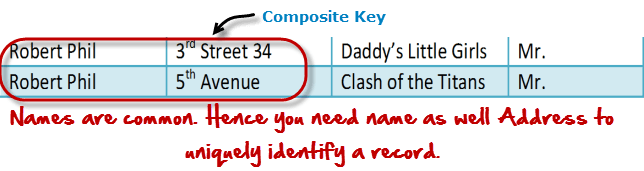
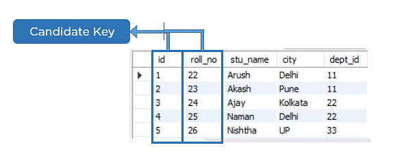
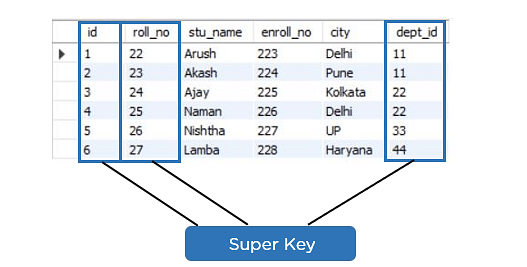

## Primary Key
A primary is a single column value used to identify a database record uniquely.

It has the following attributes:
* A primary key cannot be NULL
* A primary key value must be unique
```
CREATE TABLE CUSTOMERS(
ID   INT              NOT NULL,
NAME VARCHAR (20)     NOT NULL,
AGE  INT              NOT NULL,
ADDRESS  CHAR (25) ,
SALARY   DECIMAL (18, 2),       
PRIMARY KEY (ID)
);

ALTER TABLE CUSTOMER ADD PRIMARY KEY (ID);

ALTER TABLE CUSTOMERS ADD CONSTRAINT PK_CUSTID PRIMARY KEY (ID, NAME);

```

Delete Primary Key
```
ALTER TABLE CUSTOMERS DROP PRIMARY KEY ;
```


## Candidate/Composite Key
A composite key is a primary key composed of multiple columns used to identify a record uniquely
Hence, we require both Full Name and Address to identify a record uniquely. That is a composite key.





## Super Key
Super key is a set of over one key that can identify a record uniquely in a table, and the Primary Key is a subset of Super Key.

Let’s understand this with the help of an example.


## Foreign Key
Foreign Key references the primary key of another Table! It helps connect your Tables

* A foreign key can have a different name from its primary key
* It ensures rows in one table have corresponding rows in another
* Unlike the Primary key, they do not have to be unique. Most often they aren’t
* Foreign keys can be null even though primary keys can not

```
CUSTOMERS table

CREATE TABLE CUSTOMERS(
ID   INT              NOT NULL,
NAME VARCHAR (20)     NOT NULL,
AGE  INT              NOT NULL,
ADDRESS  CHAR (25) ,
SALARY   DECIMAL (18, 2),       
PRIMARY KEY (ID)
);

ORDERS table

CREATE TABLE ORDERS (
ID          INT        NOT NULL,
DATE        DATETIME,
CUSTOMER_ID INT references CUSTOMERS(ID),
AMOUNT     double,
PRIMARY KEY (ID)
);

If the ORDERS table has already been created and the foreign key has not yet been set, the use the syntax for specifying a foreign key by altering a table.

ALTER TABLE ORDERS ADD FOREIGN KEY (Customer_ID) REFERENCES CUSTOMERS (ID);
```

DROP a FOREIGN KEY Constraint
```
ALTER TABLE ORDERS DROP FOREIGN KEY;
```

## NOT NULL Constraint
Ensures that a column cannot have NULL value.

```
CREATE TABLE CUSTOMERS(
   ID   INT              NOT NULL,
   NAME VARCHAR (20)     NOT NULL,
   AGE  INT              NOT NULL,
   ADDRESS  CHAR (25) ,
   SALARY   DECIMAL (18, 2),       
   PRIMARY KEY (ID)
);

ALTER TABLE CUSTOMERS MODIFY SALARY  DECIMAL (18, 2) NOT NULL;
```
## DEFAULT Constraint 
Provides a default value for a column when none is specified.

```
CREATE TABLE CUSTOMERS(
   ID   INT              NOT NULL,
   NAME VARCHAR (20)     NOT NULL,
   AGE  INT              NOT NULL,
   ADDRESS  CHAR (25) ,
   SALARY   DECIMAL (18, 2) DEFAULT 5000.00,       
   PRIMARY KEY (ID)
);

ALTER TABLE CUSTOMERS MODIFY SALARY  DECIMAL (18, 2) DEFAULT 5000.00; 

```

Drop Default Constraint
```
ALTER TABLE CUSTOMERS ALTER COLUMN SALARY DROP DEFAULT;
```


## UNIQUE Constraint 
Ensures that all values in a column are different.

```
CREATE TABLE CUSTOMERS(
ID   INT              NOT NULL,
NAME VARCHAR (20)     NOT NULL,
AGE  INT              NOT NULL UNIQUE,
ADDRESS  CHAR (25) ,
SALARY   DECIMAL (18, 2),       
PRIMARY KEY (ID)
);

ALTER TABLE CUSTOMERS MODIFY AGE INT NOT NULL UNIQUE;

You can also use the following syntax, which supports naming the constraint in multiple columns as well.

ALTER TABLE CUSTOMERS ADD CONSTRAINT myUniqueConstraint UNIQUE(AGE, SALARY);

```

DROP a UNIQUE Constraint
```
ALTER TABLE CUSTOMERS DROP CONSTRAINT myUniqueConstraint;
```


## CHECK Constraint 
The CHECK constraint ensures that all the values in a column satisfies certain conditions.

```
CREATE TABLE CUSTOMERS(
   ID   INT              NOT NULL,
   NAME VARCHAR (20)     NOT NULL,
   AGE  INT              NOT NULL CHECK (AGE >= 18),
   ADDRESS  CHAR (25) ,
   SALARY   DECIMAL (18, 2),       
   PRIMARY KEY (ID)
);

ALTER TABLE CUSTOMERS MODIFY AGE INT NOT NULL CHECK (AGE >= 18 );

ALTER TABLE CUSTOMERS ADD CONSTRAINT myCheckConstraint CHECK(AGE >= 18);

```
DROP a CHECK Constraint

```
ALTER TABLE CUSTOMERS DROP CONSTRAINT myCheckConstraint;
```

## INDEX 
Used to create and retrieve data from the database very quickly.
```
CREATE TABLE CUSTOMERS(
ID   INT              NOT NULL,
NAME VARCHAR (20)     NOT NULL,
AGE  INT              NOT NULL,
ADDRESS  CHAR (25) ,
SALARY   DECIMAL (18, 2),       
PRIMARY KEY (ID)
);

CREATE INDEX index_name ON table_name ( column1, column2.....);
CREATE INDEX idx_age ON CUSTOMERS ( AGE );
```
DROP an INDEX Constraint
```
ALTER TABLE CUSTOMERS DROP INDEX idx_age;
```
