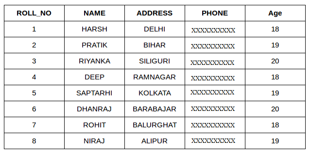

# Joins

A SQL Join statement is used to combine data or rows from two or more tables based on a common field between them.

Different types of Joins are:

* INNER JOIN
* LEFT JOIN
* RIGHT JOIN
* FULL JOIN

Consider the two tables below:




## INNER JOIN

The INNER JOIN keyword selects all rows from both the tables as long as the condition satisfies.

This keyword will create the result-set by combining all rows from both the tables where the condition satisfies
i.e value of the common field will be same.


Syntax:

```
SELECT table1.column1,table1.column2,table2.column1,....
FROM table1 INNER JOIN table2
ON table1.matching_column = table2.matching_column;
```

Example 
```
SELECT StudentCourse.COURSE_ID, Student.NAME, Student.AGE 
FROM Student INNER JOIN StudentCourse
ON Student.ROLL_NO = StudentCourse.ROLL_NO;
```


## LEFT JOIN

This join returns all the rows of the table on the left side of the join and matching rows for the table on the right side of join.

The rows for which there is no matching row on right side, the result-set will contain null.

LEFT JOIN is also known as LEFT OUTER JOIN.


Syntax:

```
SELECT table1.column1,table1.column2,table2.column1,....
FROM table1 LEFT JOIN table2
ON table1.matching_column = table2.matching_column;
```


## RIGHT JOIN

RIGHT JOIN is similar to LEFT JOIN. 

This join returns all the rows of the table on the right side of the join and matching rows for the table on the left side of join. 

The rows for which there is no matching row on left side, the result-set will contain null. 

RIGHT JOIN is also known as RIGHT OUTER JOIN.


Syntax:
```
SELECT table1.column1,table1.column2,table2.column1,....
FROM table1 RIGHT JOIN table2
ON table1.matching_column = table2.matching_column;
```

Example

```
SELECT Student.NAME,StudentCourse.COURSE_ID 
FROM Student RIGHT JOIN StudentCourse 
ON StudentCourse.ROLL_NO = Student.ROLL_NO;
```


## FULL JOIN

FULL JOIN creates the result-set by combining result of both LEFT JOIN and RIGHT JOIN. 

The result-set will contain all the rows from both the tables. 

The rows for which there is no matching, the result-set will contain NULL values.


Syntax:
```
SELECT table1.column1,table1.column2,table2.column1,....
FROM table1 FULL JOIN table2
ON table1.matching_column = table2.matching_column;
```

Example:
```
SELECT Student.NAME,StudentCourse.COURSE_ID 
FROM Student FULL JOIN StudentCourse 
ON StudentCourse.ROLL_NO = Student.ROLL_NO;
```


