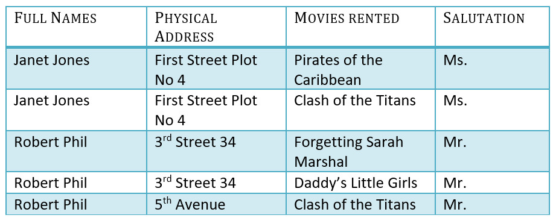
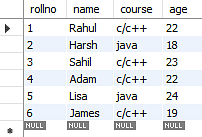
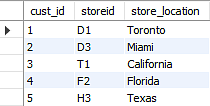
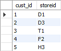
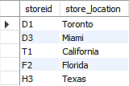
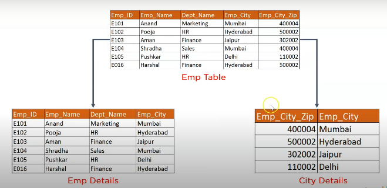
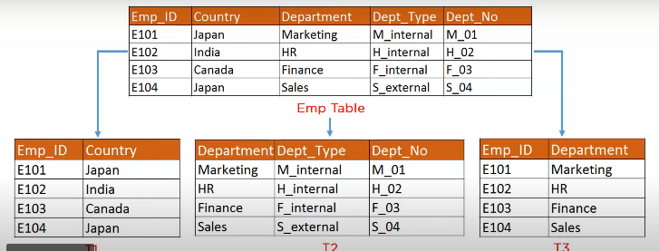

## Core

## Primary Key
A primary is a single column value used to identify a database record uniquely.

It has the following attributes: 
* A primary key cannot be NULL
* A primary key value must be unique

## Candidate/Composite Key
A composite key is a primary key composed of multiple columns used to identify a record uniquely
Hence, we require both Full Name and Address to identify a record uniquely. That is a composite key.

## Super Key
Super key is a set of over one key that can identify a record uniquely in a table, and the Primary Key is a subset of Super Key.

Let’s understand this with the help of an example.

## Foreign Key
Foreign Key references the primary key of another Table! It helps connect your Tables

* A foreign key can have a different name from its primary key
* It ensures rows in one table have corresponding rows in another
* Unlike the Primary key, they do not have to be unique. Most often they aren’t
* Foreign keys can be null even though primary keys can not

## Relationship in Database Table

###One to One (1:1)

* Country - capital city
* Person - their fingerprints
* Email - user account

###One to Many or Many to One
* Customer - Orders
* Order - Items
* Country - States

###Many to Many relationships
* Books - Authors
* Students - Courses
* Users - Roles

##Normalization

Reference https://www.simplilearn.com/tutorials/sql-tutorial/what-is-normalization-in-sql

Normalization is the process of removing redundant data from the database by splitting the table in a well-defined manner in order to maintain data integrity. This process saves much of the storage space.

##First Normal Form (1NF)
A relation is said to be in 1NF only when 
* all the entities of the table contain unique or atomic values.
* if atomicity of the table is 1.
  Here, atomicity states that a single cell cannot hold multiple values. 
  It must hold only a single-valued attribute.

Below is a students’ record table that has information about student roll number, student name, student course, and age of the student.

In the studentsrecord table, you can see that the course column has two values. Thus it does not follow the First Normal Form. Now, if you use the First Normal Form to the above table, you get the below table as a result.

## Second Normal Form (2NF)
A relation is said to be in 2NF only if 
* it is in 1NF and all the 
* non-key attribute of the table is fully dependent on the primary key.

Example 1

We have divided our 1NF table into two tables viz. Table 1 and Table2. Table 1 contains member information. Table 2 contains information on movies rented.

We have introduced a new column called Membership_id which is the primary key for table 1. Records can be uniquely identified in Table 1 using membership id

Example 2
Consider the table Location:

The Location table possesses a composite primary key cust_id, storeid. 

The non-key attribute is store_location. 

In this case, store_location only depends on storeid, which is a part of the primary key. Hence, this table does not fulfill the second normal form.

To bring the table to Second Normal Form, you need to split the table into two parts.

As you have removed the partial functional dependency from the location table, the column store_location entirely depends on the primary key of that table, storeid.

## Third Normal Form (3NF)
A relation is said to be in 3NF only if 
* it is in 2NF and 
* every non-key attribute of the table is not transitively dependent on the primary key.

## Boyce CoddNormal Form (BCNF)
* It is in 3NF and all the
* Every Right-Hand Side (RHS) attribute of the functional dependencies should depend on the super key of that particular table.

