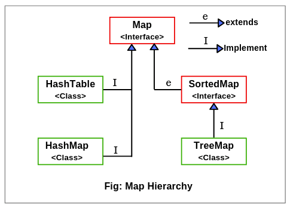
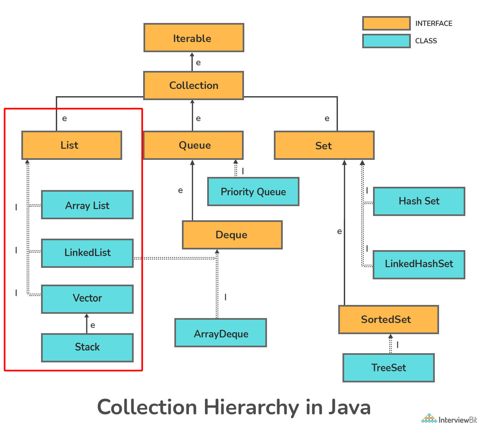
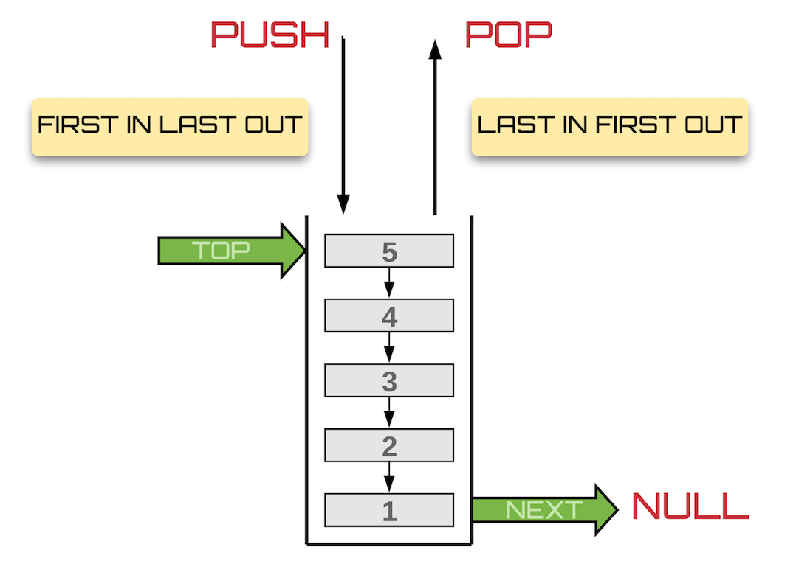
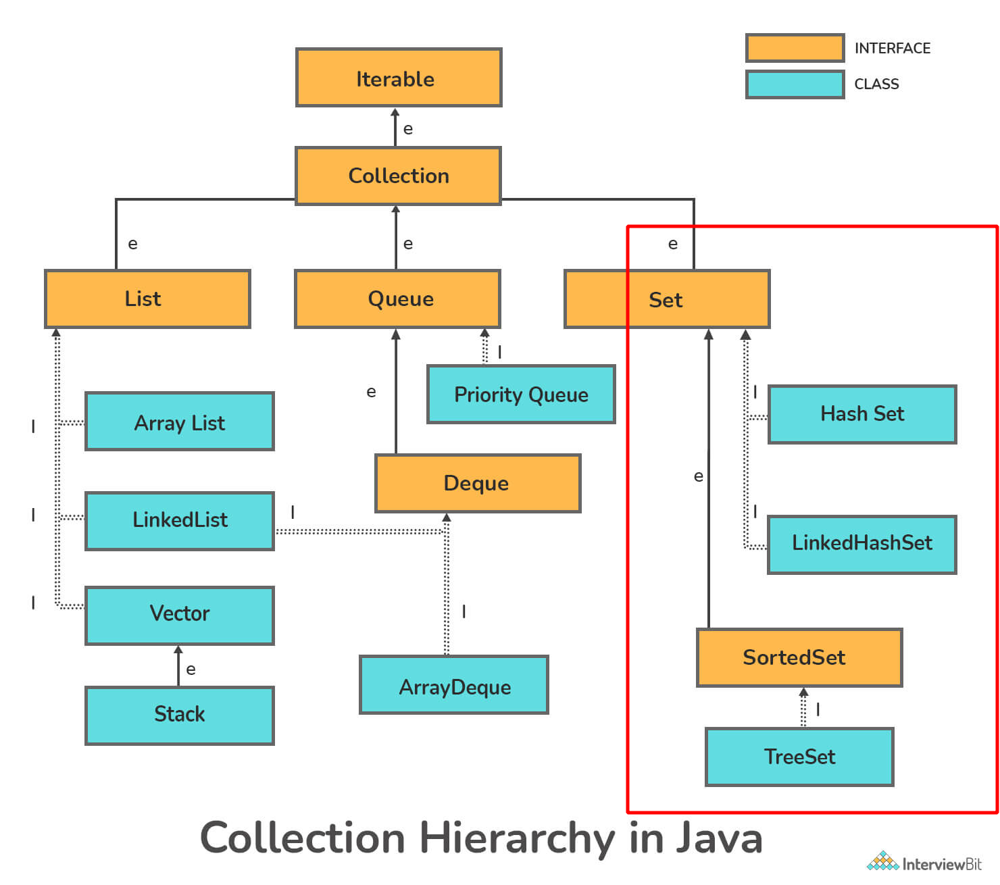
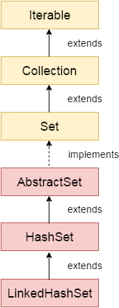

## Table Of Contents

- [Collections](#collections)
  - [Difference Collection and collections in the context of Java](#difference-collection-and-collections-in-the-context-of-java)
  - [Hierarchy of the Collection framework](#hierarchy-of-the-collection-framework)
    - [Iterator and ListIterator](#iterator-and-listiterator)
  - [List](#list)
    - [ArrayList](#arraylist)
    - [LinkedList](#linkedlist)
    - [Vector](#vector)
    - [Stack](#stack)
    - [CopyOnWriteArrayList](#CopyOnWriteArrayList)
  - [ArrayList and LinkedList](#arraylist-and-linkedlist)
  - [ArrayList and Vector](#arraylist-and-vector)
  - [Set Interface](#set-interface)
    - [HashSet](#hashset)
    - [LinkedHashSet](#linkedhashset)
  - [SortedSet Interface](#sortedset-interface)
    - [TreeSet](#treeset)

# Collections

## Difference Collection and collections in the context of Java


[Back To Top](#Table-Of-Contents)

| Collection                                                                                                                                                                               | Collections                                                                                                                      |
| ------------------------------------------------------------------------------------------------------------------------------------------------------------------------------------------ | ---------------------------------------------------------------------------------------------------------------------------------- |
| Collection is a **interface** present in java.util.package                                                                                                                                   | Collections is a utility **class** present in java.util.package                                                                      |
| The collection is considered as the root interface of the collection framework. It provides several classes and interfaces to represent a group of individual objects as a single unit. | It defines several utility methods like sorting and searching which is used to operate on collection. It has all static methods. |
| Since Java 8, the Collection is an interface with a static function. Abstract and default methods can also be found in the Interface.                                                   | It only has static methods in it.                                                                                                |

[Back To Top](#Table-Of-Contents)


## Hierarchy of the Collection framework


[Back To Top](#Table-Of-Contents)

Collection framework hierarchy is made up of four fundamental interfaces: 
* Collection, 
* List, 
* Set, 
* Map, 
and two specific interfaces for sorting called 
* SortedSet and 
* SortedMap.

The **java.util** package contains all of the collection framework's interfaces and classes. The following diagram depicts the Java collection structure.


Here, e denotes extends, i denotes implements



[Back To Top](#Table-Of-Contents)


### Iterator and ListIterator


[Back To Top](#Table-Of-Contents)

| Iterator                                                                        | ListIterator                                                                                   |
| --------------------------------------------------------------------------------- | ------------------------------------------------------------------------------------------------ |
| The Iterator traverses the elements in the forward direction only.              | ListIterator traverses the elements in backward and forward directions both.                   |
| The Iterator can be used in List, Set, and Queue.                               | ListIterator can be used in List only.                                                         |
| The Iterator can only perform remove operation while traversing the collection. | ListIterator can perform ?add,? ?remove,? and ?set? operation while traversing the collection. |

## List


[Back To Top](#Table-Of-Contents)

1. Elements are arranged sequentially ordered.
2. List maintains an order of elements means the order is retained in which we add elements, and the same sequence we will get while retrieving elements.
3. We can insert elements into the list at any location.
4. The list allows storing duplicate elements in Java.
5. ArrayList, vector, and LinkedList are three concrete subclasses that implement the list interface.



[Back To Top](#Table-Of-Contents)

### ArrayList


[Back To Top](#Table-Of-Contents)

* ArrayList provides us with dynamic arrays in Java.
* Though, it may be slower than standard arrays but can be helpful in programs where lots of manipulation in the array is needed.
* The size of an ArrayList is increased automatically if the collection grows or shrinks if the objects are removed from the collection.
* ArrayList allows us to randomly access the list

```java
ArrayList<Integer> arrlist = new ArrayList<Integer>(n);
```

[Back To Top](#Table-Of-Contents)

### LinkedList


[Back To Top](#Table-Of-Contents)

* A linked list is a linear data structure, in which the elements are not stored at contiguous memory locations.
* In simple words, a linked list consists of nodes where each node contains a data field and a reference(link) to the next node in the list.

```java
LinkedList llist = new LinkedList();
```

* The elements in a linked list are linked using pointers as shown in the below image:


### Vector


[Back To Top](#Table-Of-Contents)

* A vector provides us with dynamic arrays in Java.
* Though, it may be slower than standard arrays but can be helpful in programs where lots of manipulation in the array is needed.
* This is identical to ArrayList in terms of implementation. However, the primary difference between a vector and an ArrayList is that a <ins>**Vector is synchronized**</ins> and an <ins>**ArrayList is non-synchronized**</ins>.

```java
Vector<Integer> v = new Vector();
```

### Stack


[Back To Top](#Table-Of-Contents)

* The stack is the subclass of Vector.
* It implements the last-in-first-out data structure, i.e., Stack.
* The stack contains all of the methods of Vector class and
* also provides its methods like boolean push(), boolean peek(), boolean push(object o), which defines its properties.

```java
    Stack<E> stack = new Stack<E>();
```



## CopyOnWriteArrayList


[Back To Top](#Table-Of-Contents)

It is an enhanced version of ArrayList in which all modifications (add, set, remove, etc) are implemented by making a fresh copy. 

It is found in java.util.concurrent package. It is a data structure created to be used in a concurrent environment.


[Back To Top](#Table-Of-Contents)

## ArrayList and LinkedList


[Back To Top](#Table-Of-Contents)


| ArrayList                                                     | LinkedList                                                        |
| --------------------------------------------------------------- | ------------------------------------------------------------------- |
| ArrayList uses a dynamic array.                               | LinkedList uses a doubly linked list.                             |
| ArrayList is better to store and fetch data.                  | LinkedList is better to manipulate data.                          |
| ArrayList provides random access.                             | LinkedList does not provide random access.                        |
| ArrayList takes less memory overhead as it stores only object | LinkedList takes more memory overhead, as it stores the object as |
| well as the address of that object.                           |                                                                   |

## ArrayList and Vector


[Back To Top](#Table-Of-Contents)


| ArrayList                                                 | Vector                                                             |
| ----------------------------------------------------------- | -------------------------------------------------------------------- |
| ArrayList is not synchronized.                            | Vector is synchronized.                                            |
| ArrayList is not a legacy class.                          | Vector is a legacy class.                                          |
| ArrayList increases its size by 50% of the array size.    | Vector increases its size by doubling the array size.              |
| ArrayList is not ?thread-safe? as it is not synchronized. | Vector list is ?thread-safe? as it?s every method is synchronized. |

## Set Interface


[Back To Top](#Table-Of-Contents)

* This interface represents a collection of elements that contains unique elements
* Set interface does not maintain any order while storing elements and while retrieving, we may not get the same order as we put elements.
* Set does not allow any duplicate elements.
* <ins>**HashSet, LinkedHashSet, TreeSet**</ins> classes implements the set interface and sorted interface extends a set interface.



### HashSet


[Back To Top](#Table-Of-Contents)


`public class HashSet<E> extends AbstractSet<E> implements Set<E>, Cloneable, Serializable`

* Uses a hash table for storage.
  * It inherits the AbstractSet class and implements Set interface.
* contains unique elements only.
* allows null value.
* class is non synchronized.
* <ins>**Does not maintain order**<ins>
* HashSet is the best approach for search operations.
* The initial default capacity of HashSet is 16, and the load factor is 0.75.

```java
HashSet hs = new HashSet();
```


### LinkedHashSet


[Back To Top](#Table-Of-Contents)

```java
public class LinkedHashSet<E> extends HashSet<E> implements Set<E>, Cloneable, Serializable
```

* Ordered version of HashSet
* LinkedHashSet class is a Hashtable and Linked list implementation of the set interface.
* It inherits HashSet class and implements Set interface.
* Contains unique elements only like HashSet
* Allows null value
* Class is non synchronized.
* <ins>**Maintains order**<ins>

1. [Example 1](../../src/main/java/org/learning/javapractice/collections/set/LinkedHashSetExample1.java)



[Back To Top](#Table-Of-Contents)

## SortedSet Interface


[Back To Top](#Table-Of-Contents)

* This interface extends a set, provides a ordering on its elements.
* <ins>**TreeSet**</ins> implements the sorted interface.

[Back To Top](#Table-Of-Contents)

### TreeSet


[Back To Top](#Table-Of-Contents)

1. It inherits AbstractSet class and implements the NavigableSet interface.
2. Contains unique elements only like HashSet
3. TreeSet class doesn't allow null element.
4. TreeSet class is non synchronized.
5. Objects are stored in sorted, ascending order. But we can iterate in descending order using method TreeSet.descendingIterator().
6. TreeSet class access and retrieval times are quiet fast.
7. TreeSet doesn’t use hashCode() and equals() methods to compare it’s elements.
8. It uses compare() (or compareTo()) method to determine the equality of two elements.


