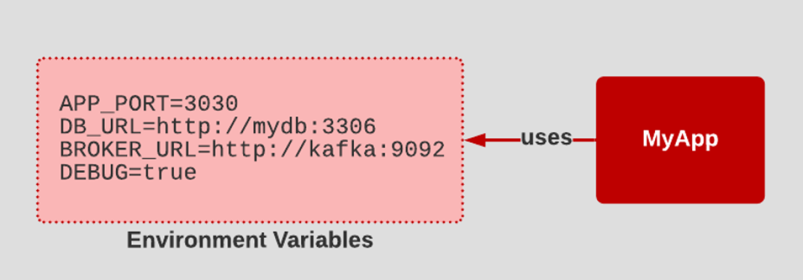

# Core Java

---

## Table Of Contents


| No. | Topics                                                                          |
| --- |---------------------------------------------------------------------------------|
| *   | [SOLID Principles](#Solid-Principle)                                            |
| *   | [12 Factor App](#12-Factor-App)                                                 |
| *   | [Explain JRE, KDK and JVM](#Explain-JRE-JDK-and-JVM)                            |
| *   | [JVM (Java Virtual Machine) Architecture](#jvm-java-virtual-machine-architecture) |
| *   | [Memory Management](#memory-management)                                         |
| *   | [Immutable Objects](#Immutable-object)                                          |


## 12 Factor App

[Back To Top](#Table-Of-Contents)

The 12 Factor App methodology is pattern to designing scalable application architecture.

1. Codebase
2. Dependencies
3. Config
4. Backing services
5. Build, release, run
6. Processes
7. Port binding
8. Concurrency
9. Disposability
10. Dev/prod parity
11. Logs
12. Admin processes


### Codebase
One codebase tracked in revision control, many deploys

The Codebase principle states that all assets related to an application, everything from source code, the provisioning script, and configuration settings, are stored in a source code repository that is accessible to development, testing.


### Dependencies

Explicitly declare and isolate dependencies.

You want to avoid storing artifacts along with source code in the source code repository.

### Config

Store config in the environment

The Config principle states that configuration information is injected into the runtime environment as environment variables or as settings defined in an independent configuration file.



### Backing services

Treat backing services as attached resources

The Backing Services principle encourages architects to treat external components such as databases, email servers, message brokers, and independent services that can be provisioned and maintained by systems personnel as attached resources.


### Build, release, run

Strictly separate build and run stages

Build, Release, and Run breaks the deployment process down into three replicable stages that can be instantiated at any time.

* Build stage is where code is retrieved from the source code management system and built/compiled into artifacts stored in an artifact repository.
* Release stage : After the code is built, configuration settings are applied in the Release stage.
* Run stage, a runtime environment is provisioned via scripts using a tool such as Ansible. 

The application and its dependencies are deployed into the newly provisioned runtime environment.


### Processes

Execute the app as one or more stateless processes


### Port binding

### Concurrency

### Disposability

### Dev/prod parity

### Logs

### Admin processes


[Back To Top](#Table-Of-Contents)


## Solid Principle

[Back To Top](#Table-Of-Contents)

References: 
* [https://www.baeldung.com/solid-principles](https://www.baeldung.com/solid-principles)


It is conceptualized by Robert C. Martin (also known as Uncle Bob) in his 2000 paper “Design Principles and Design Patterns.”

These design principles encourage us to create more maintainable, understandable, and flexible software.

The word SOLID acronym for:

* Single Responsibility Principle (SRP)
* Open-Closed Principle (OCP)
* Liskov Substitution Principle (LSP)
* Interface Segregation Principle (ISP)
* Dependency Inversion Principle (DIP)

### Single Responsibility Principle (SRP)
Every Java class must perform a single functionality

### Open-Closed Principle (OCP)
Open for extension but closed for modification. The extension allows us to implement new functionality to the module.

### Liskov Substitution Principle (LSP)

It applies to inheritance in such a way that the derived classes must be completely substitutable for their base classes. 

In other words, if class A is a subtype of class B, then we should be able to replace B with A without interrupting the behavior of the program.

### Interface Segregation Principle (ISP)
Larger interfaces should be split into smaller ones. Because the implementation classes use only the methods that are required. We should not force the client to use the methods that they do not want to use.

### Dependency Inversion Principle (DIP)
The principle states that we must use abstraction (abstract classes and interfaces) instead of concrete implementations.

High-level modules should not depend on the low-level module but both should depend on the abstraction. Because the abstraction does not depend on detail but the detail depends on abstraction. It decouples the software.

[Back To Top](#Table-Of-Contents)


## Explain JRE JDK and JVM


[Back To Top](#Table-Of-Contents)


### **JDK (Java Development Kit)**

JDK is a Kit that provides the environment to develop and execute(run) the Java program. JDK is a kit(or package) that includes two things

* Development Tools(to provide an environment to develop your java programs)
* JRE (to execute your java program).

### **JRE (Java Runtime Environment)**

---

JRE is an installation package that provides an environment to only run(not to develop) the java program(or application) onto your machine.

### **JVM (Java Virtual Machine)**

---

* JVM is a very important part of both JDK and JRE because it is contained or inbuilt in both.
* Whatever Java program you run using JRE or JDK goes into JVM and
* JVM is responsible for executing the java program line by line, hence it is also known as an interpreter.

[Back To Top](#Table-Of-Contents)

## **JVM (Java Virtual Machine) Architecture**


[Back To Top](#Table-Of-Contents)

* JVM is a very important part of both JDK and JRE because it is contained or inbuilt in both.
* Whatever Java program you run using JRE or JDK goes into JVM and
* JVM is responsible for executing the java program line by line, hence it is also known as an interpreter.

The JVM performs the following main tasks:

* Loads code
* Verifies code
* Executes code
* Provides runtime environment

JVM Architecture in Java : There are three main subsystems in JVM Architecture:

1. ClassLoader
2. Memory Area
3. Execution Engine


### Classloader

Whenever we run the java program, it is loaded first by the classloader.
There are three built-in classloaders in Java.

#### Bootstrap ClassLoader:

* Super class of Extension classloader.
* It loads the rt.jar file which contains all class files of Java Standard Edition like
  * java.lang package classes,
  * java.net package classes,
  * java.util package classes,
  * java.io package classes,
  * java.sql package classes etc.

#### Extension ClassLoader:

* This is the child classloader of Bootstrap and parent classloader of System classloader.
* It loads the jar files located inside $JAVA_HOME/jre/lib/ext directory.

#### System/Application ClassLoader:

* This is the child classloader of Extension classloader.
* It loads the class files from classpath.
* By default, classpath is set to current directory.
* You can change the classpath using "-cp" or "-classpath" switch.
* It is also known as Application classloader.

```
Note: java.lang.ClassNotFoundException
JVM follows the Delegation-Hierarchy principle to load classes. 
System class loader delegate load request to extension class loader 
  and extension class loader delegate request to the bootstrap class loader. 
If a class found in the boot-strap path, the class is loaded otherwise 
  request again transfers to the extension class loader 
  and then to the system class loader. 
At last, if the system class loader fails to load class, 
  then we get run-time exception java.lang.ClassNotFoundException.
```

**Three important functions of ClassLoader are** :

#### Loading

This operation loads files from secondary memory into the main memory (RAM) for execution.

* Method area:
  * In the method area, all class level information like class name, immediate parent class name, methods and variables information etc. are stored, including static variables.
  * There is only one method area per JVM, and it is a shared resource.
* Heap area:
  * Information of all objects is stored in the heap area.
  * There is also one Heap Area per JVM.
  * It is also a shared resource.
* Stack area:
  * For every thread, JVM creates one run-time stack which is stored here.
  * Every block of this stack is called activation record/stack frame which stores methods calls.
  * All local variables of that method are stored in their corresponding frame.
  * After a thread terminates, its run-time stack will be destroyed by JVM.
  * It is not a shared resource.
* Program Counter (PC) Registers:
  * Store address of current execution instruction of a thread. PC (program counter) register contains the address of the Java virtual machine instruction currently being executed.
  * Obviously, each thread has separate PC Registers.
* Native method stacks:
  * For every thread, a separate native stack is created.
  * It stores native method information.

#### Linking

Performs verification, preparation, and (optionally) resolution.

* Verification:

  It ensures the correctness of the .class file i.e. it checks whether this file is properly formatted and generated by a valid compiler or not. If verification fails, we get run-time exception java.lang.VerifyError. This activity is done by the component ByteCodeVerifier. Once this activity is completed then the class file is ready for compilation.
* Preparation:

  JVM allocates memory for class variables and initializing the memory to default values.
* Resolution:

  It is the process of replacing symbolic references from the type with direct references. It is done by searching into the method area to locate the referenced entity.

#### Initialization

In this phase, all static variables are assigned with their values defined in the code and static block(if any). This is executed from top to bottom in a class and from parent to child in the class hierarchy.

### Execution Engine

* Execution engine executes the .class (bytecode).
* It reads the byte-code line by line, uses data and information present in various memory area and executes instructions.
* It has three major components namely a
  * virtual processor,
  * an interpreter,

    * Read bytecode stream then execute the instructions.
  * JIT compiler.

    * It is used to increase the efficiency of an interpreter.
    * It compiles the entire bytecode and changes it to native code so whenever the interpreter sees repeated method calls, JIT provides direct native code for that part so re-interpretation is not required, thus efficiency is improved.

### Java Native Interface (JNI) :

* It is an interface that interacts with the Native Method Libraries and provides the native libraries(C, C++) required for the execution.
* It enables JVM to call C/C++ libraries and to be called by C/C++ libraries which may be specific to hardware.

### Native Method Libraries :

* It is a collection of the Native Libraries(C, C++) which are required by the Execution Engine.

[Back To Top](#Table-Of-Contents)

## Memory Management


[Back To Top](#Table-Of-Contents)

## Immutable Objects

[Back To Top](#Table-Of-Contents)

An immutable object is an object whose internal state remains constant after it has been entirely created.

Example : String class

To create immutable because:
* declare the class as final, so it cannot be extended 
* all class members should be private, so they cannot be accessed outside of class 
* class members are only initialized using constructor
* shouldn't contain any setter methods to change the value of class members 
* the getter method should return the copy of class members 

Example given below:

```
 // class is declared final, so it cannot be extended 
final class ImmutableClass {

  // private class members, so they cannot be accessed outside of class 
  private String name;

  ImmutableClass(String name) {
    // class members are initialized using constructor
    this.name = name;
  }

  // getter method returns the copy of class members
  public String getName() {
    return name;
  }
}
```

[Back To Top](#Table-Of-Contents)

## Title of Topic

[Back To Top](#Table-Of-Contents)

Body of the topic

[Back To Top](#Table-Of-Contents)

## Title of Topic

[Back To Top](#Table-Of-Contents)

Body of the topic

[Back To Top](#Table-Of-Contents)