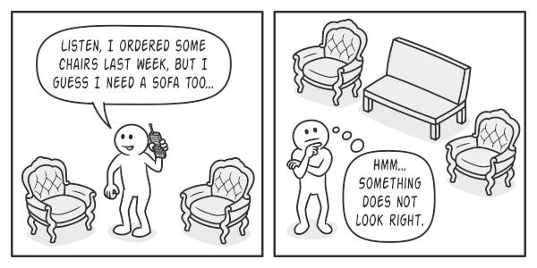
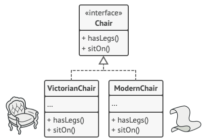
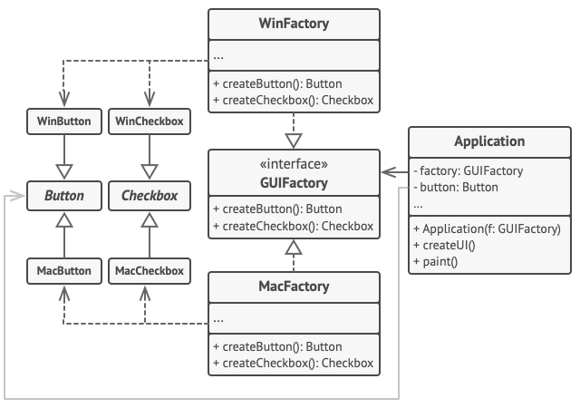

# Design Patterns

## Table Of Contents

- [What's a design pattern](#Whats-a-design-pattern)
- [Classification of patterns](#Classification-of-patterns)
- [Creational patterns](#Creational-patterns)
  - [Factory Method](#Factory-Method)
  - [Abstract Factory](#Abstract-Factory)
  - [Builder](#Builder) 
  - [Prototype](#Prototype)
  - [Singleton](#Singleton)
- [Structural patterns](#Structural-patterns)
  - Adapter
  - Bridge
  - Composite
  - Decorator
  - Facade
  - Flyweight
  - Proxy
- [Behavioral patterns](#Behavioral-patterns)
  - Chain of Responsibility
  - Command
  - Iterator
  - Memento
  - Observer
  - State
  - Strategy
  - Template Method
  - Visitor

## What's a design pattern?


[Back To Top](#Table-Of-Contents)

Design patterns are typical solutions to common problems in software design. Each pattern is like a blueprint that you can customize to solve a particular design problem in your code.

[Back To Top](#Table-Of-Contents)

## Classification of patterns


[Back To Top](#Table-Of-Contents)

### Creational patterns 
Provide object creation mechanisms that increase flexibility and reuse of existing code.

* Factory Method: Also known as: Virtual Constructor
* Abstract Factory
* Builder
* Prototype
* Singleton


### Structural patterns 

Explain how to assemble objects and classes into larger structures, while keeping these structures flexible and efficient.

* Adapter:  Also known as: Wrapper
* Bridge
* Composite:  Also known as: Object Tree
* Decorator:   Also known as: Wrapper
* Facade
* Flyweight:   Also known as: Cache
* Proxy


### Behavioral patterns 

Take care of effective communication and the assignment of responsibilities between objects.

* Chain of Responsibility: Also known as: CoR, Chain of Command
* Command: Also known as: Action, Transaction
* Iterator: Mediator: Also known as: Intermediary, Controller
* Memento: Also known as: Snapshot
* Observer: Also known as: Event-Subscriber, Listener
* State
* Strategy
* Template Method
* Visitor


[Back To Top](#Table-Of-Contents)


## Factory Method


[Back To Top](#Table-Of-Contents)

References:
* [https://refactoring.guru/design-patterns/factory-method](https://refactoring.guru/design-patterns/factory-method)

### Intent

Factory Method is a creational design pattern that provides an interface for creating objects in a superclass, but allows subclasses to alter the type of objects that will be created.

### Solution
The Factory Method pattern suggests that you replace direct object construction calls (using the new operator) with calls to a special factory method. 

Don’t worry: the objects are still created via the new operator, but it’s being called from within the factory method.

### Applicability
* Use the Factory Method when you don’t know beforehand the exact types and dependencies of the objects your code should work with.
* Use the Factory Method when you want to provide users of your library or framework with a way to extend its internal components.
* Use the Factory Method when you want to save system resources by reusing existing objects instead of rebuilding them each time.

### Structure


Example 1: 


Example 2:


[Back To Top](#Table-Of-Contents)


## Abstract Factory


[Back To Top](#Table-Of-Contents)

References:
* [https://refactoring.guru/design-patterns/abstract-factory](https://refactoring.guru/design-patterns/abstract-factory)

### Intent
Abstract Factory is a creational design pattern that lets you produce families of related objects without specifying their concrete classes.

For example, products Chair + Sofa + CoffeeTable are available in these variants: Modern, Victorian, ArtDeco


You need a way to create individual furniture objects so that they match other objects of the same family. Customers get quite mad when they receive non-matching furniture.



Also, you don’t want to change existing code when adding new products or families of products to the program. Furniture vendors update their catalogs very often, and you wouldn’t want to change the core code each time it happens.

### Solution

Abstract Factory pattern suggests is to explicitly declare interfaces for each distinct product of the product family (e.g., chair, sofa or coffee table). 

Then you can make all variants of products follow those interfaces. For example, all chair variants can implement the Chair interface; all coffee table variants can implement the CoffeeTable interface, and so on.




### Structure


Example 1:



### Applicability

Use the Abstract Factory when your code needs to work with various families of related products, but you don’t want it to depend on the concrete classes of those products—they might be unknown beforehand or you simply want to allow for future extensibility.


[Back To Top](#Table-Of-Contents)

## Builder


[Back To Top](#Table-Of-Contents)

Reference: 

* [https://refactoring.guru/design-patterns/builder](https://refactoring.guru/design-patterns/builder)

### Intent
Builder is a creational design pattern that lets you construct complex objects step by step. The pattern allows you to produce different types and representations of an object using the same construction code.

### Problem
Imagine a complex object that requires laborious, step-by-step initialization of many fields and nested objects. Such initialization code is usually buried inside a monstrous constructor with lots of parameters. Or even worse: scattered all over the client code.

In most cases most of the parameters will be unused, making the constructor calls pretty ugly. For instance, only a fraction of houses have swimming pools, so the parameters related to swimming pools will be useless nine times out of ten.


### Solution

The Builder pattern suggests that you extract the object construction code out of its own class and move it to separate objects called builders.

The Builder pattern lets you construct complex objects step by step. The Builder doesn’t allow other objects to access the product while it’s being built.


The pattern organizes object construction into a set of steps (buildWalls, buildDoor, etc.). To create an object, you execute a series of these steps on a builder object. The important part is that you don’t need to call all of the steps. You can call only those steps that are necessary for producing a particular configuration of an object.

Some of the construction steps might require different implementation when you need to build various representations of the product. For example, walls of a cabin may be built of wood, but the castle walls must be built with stone.

In this case, you can create several different builder classes that implement the same set of building steps, but in a different manner. Then you can use these builders in the construction process (i.e., an ordered set of calls to the building steps) to produce different kinds of objects.

#### Director

You can go further and extract a series of calls to the builder steps you use to construct a product into a separate class called director. The director class defines the order in which to execute the building steps, while the builder provides the implementation for those steps.

### Structure


Example: 


### Applicability

* Use the Builder pattern to get rid of a “telescoping constructor”. 
```java
class Pizza {
  Pizza(int size) {  }
  Pizza(int size, boolean cheese) {  }
  Pizza(int size, boolean cheese, boolean pepperoni) {  }
}
```

* Use the Builder pattern when you want your code to be able to create different representations of some product (for example, stone and wooden houses).
* Use the Builder to construct Composite trees or other complex objects.
  
  The Builder pattern lets you construct products step-by-step. You could defer execution of some steps without breaking the final product. You can even call steps recursively, which comes in handy when you need to build an object tree.


[Back To Top](#Table-Of-Contents)

## Prototype


[Back To Top](#Table-Of-Contents)

Reference:

* [https://refactoring.guru/design-patterns/prototype](https://refactoring.guru/design-patterns/prototype)


## Intent
Prototype is a creational design pattern that lets you copy existing objects without making your code dependent on their classes.


## Problem

Say you have an object, and you want to create an exact copy of it. How would you do it? First, you have to create a new object of the same class. Then you have to go through all the fields of the original object and copy their values over to the new object.

Nice! But there’s a catch. Not all objects can be copied that way because some of the object’s fields may be private and not visible from outside of the object itself.

There’s one more problem with the direct approach. Since you have to know the object’s class to create a duplicate, your code becomes dependent on that class.


## Solution

The Prototype pattern delegates the cloning process to the actual objects that are being cloned. 

The pattern declares a common interface for all objects that support cloning. 

This interface lets you clone an object without coupling your code to the class of that object. Usually, such an interface contains just a single clone method.

The implementation of the clone method is very similar in all classes. The method creates an object of the current class and carries over all of the field values of the old object into the new one. You can even copy private fields because most programming languages let objects access private fields of other objects that belong to the same class.

An object that supports cloning is called a prototype. When your objects have dozens of fields and hundreds of possible configurations, cloning them might serve as an alternative to subclassing.

### Structure


### Applicability

* Use the Prototype pattern when your code shouldn’t depend on the concrete classes of objects that you need to copy.
*  Use the pattern when you want to reduce the number of subclasses that only differ in the way they initialize their respective objects.


[Back To Top](#Table-Of-Contents)


## Singleton


[Back To Top](#Table-Of-Contents)

Reference:

* [https://refactoring.guru/design-patterns/singleton](https://refactoring.guru/design-patterns/singleton)


### Intent

Singleton is a creational design pattern that lets you ensure that a class has only one instance, while providing a global access point to this instance.

### Problem

You don’t want the code to be scattered all over your program. 

It’s much better to have it within one class, especially if the rest of your code already depends on it.

### Solution

The Singleton pattern solves two problems at the same time
* Ensure that a class has just a single instance
* Provide a global access point to that instance

All implementations of the Singleton have these two steps in common:

* Make the default constructor private, to prevent other objects from using the new operator with the Singleton class.
* Create a static creation method that acts as a constructor. Under the hood, this method calls the private constructor to create an object and saves it in a static field. All following calls to this method return the cached object.

### Structure


[Back To Top](#Table-Of-Contents)

[arbitrary_text]: https://www.somewebsite.org
