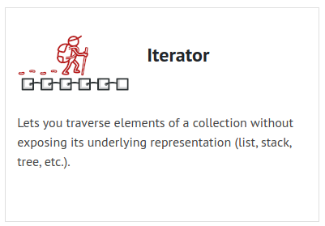
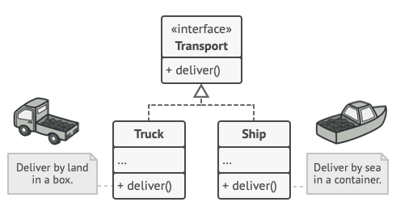
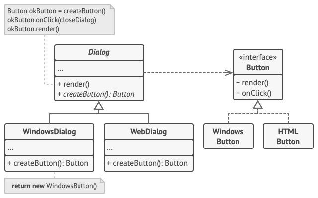
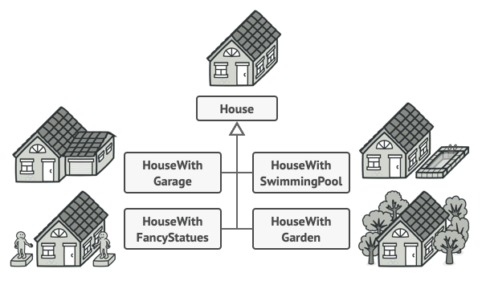
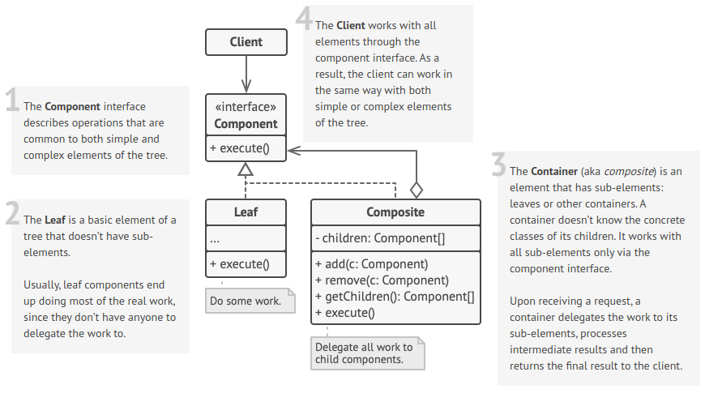

# Design Patterns

## Table Of Contents

- [What's a design pattern](#Whats-a-design-pattern)
- [Classification of patterns](#Classification-of-patterns)
- [Creational patterns](#Creational-patterns)
  - [Factory Method](#Factory-Method)
  - [Abstract Factory](#Abstract-Factory)
  - [Builder](#Builder) 
  - [Prototype](#Prototype)
  - [Singleton](#Singleton)
- [Structural patterns](#Structural-patterns)
  - [Adapter](#Adapter)
  - [Bridge](#Bridge)
  - [Composite](#Composite)
  - [Decorator](#Decorator)
  - Facade
  - Flyweight
  - Proxy
- [Behavioral patterns](#Behavioral-patterns)
  - Chain of Responsibility
  - Command
  - Iterator
  - Memento
  - Observer
  - State
  - Strategy
  - Template Method
  - Visitor

## What's a design pattern?


[Back To Top](#Table-Of-Contents)

Design patterns are typical solutions to common problems in software design. Each pattern is like a blueprint that you can customize to solve a particular design problem in your code.

[Back To Top](#Table-Of-Contents)

## Classification of patterns


[Back To Top](#Table-Of-Contents)

### Creational patterns 

[Back To Top](#Table-Of-Contents)

Provide object creation mechanisms that increase flexibility and reuse of existing code.

* Factory Method: Also known as: Virtual Constructor
* Abstract Factory
* Builder
* Prototype
* Singleton


### Structural patterns 

[Back To Top](#Table-Of-Contents)

Explain how to assemble objects and classes into larger structures, while keeping these structures flexible and efficient.

* Adapter:  Also known as: Wrapper
* Bridge
* Composite:  Also known as: Object Tree
* Decorator:   Also known as: Wrapper
* Facade
* Flyweight:   Also known as: Cache
* Proxy


### Behavioral patterns 

[Back To Top](#Table-Of-Contents)

Take care of effective communication and the assignment of responsibilities between objects.

* Chain of Responsibility: Also known as: CoR, Chain of Command
* Command: Also known as: Action, Transaction
* Iterator: Mediator: Also known as: Intermediary, Controller
* Memento: Also known as: Snapshot
* Observer: Also known as: Event-Subscriber, Listener
* State
* Strategy
* Template Method
* Visitor





[Back To Top](#Table-Of-Contents)


## Factory Method


[Back To Top](#Table-Of-Contents)

References:
* [https://refactoring.guru/design-patterns/factory-method](https://refactoring.guru/design-patterns/factory-method)

### Intent

Factory Method is a creational design pattern that provides an interface for creating objects in a superclass, but allows subclasses to alter the type of objects that will be created.

### Solution
The Factory Method pattern suggests that you replace direct object construction calls (using the new operator) with calls to a special factory method. 

Don’t worry: the objects are still created via the new operator, but it’s being called from within the factory method.

### Applicability
* Use the Factory Method when you don’t know beforehand the exact types and dependencies of the objects your code should work with.
* Use the Factory Method when you want to provide users of your library or framework with a way to extend its internal components.
* Use the Factory Method when you want to save system resources by reusing existing objects instead of rebuilding them each time.

### Structure


Example 1: 




Example 2:




[Back To Top](#Table-Of-Contents)


## Abstract Factory


[Back To Top](#Table-Of-Contents)

References:
* [https://refactoring.guru/design-patterns/abstract-factory](https://refactoring.guru/design-patterns/abstract-factory)

### Intent
Abstract Factory is a creational design pattern that lets you produce families of related objects without specifying their concrete classes.

For example, products Chair + Sofa + CoffeeTable are available in these variants: Modern, Victorian, ArtDeco


You need a way to create individual furniture objects so that they match other objects of the same family. Customers get quite mad when they receive non-matching furniture.


Also, you don’t want to change existing code when adding new products or families of products to the program. Furniture vendors update their catalogs very often, and you wouldn’t want to change the core code each time it happens.

### Solution

Abstract Factory pattern suggests is to explicitly declare interfaces for each distinct product of the product family (e.g., chair, sofa or coffee table). 

Then you can make all variants of products follow those interfaces. For example, all chair variants can implement the Chair interface; all coffee table variants can implement the CoffeeTable interface, and so on.


### Structure


Example 1:


### Applicability

Use the Abstract Factory when your code needs to work with various families of related products, but you don’t want it to depend on the concrete classes of those products—they might be unknown beforehand or you simply want to allow for future extensibility.


[Back To Top](#Table-Of-Contents)

## Builder


[Back To Top](#Table-Of-Contents)

Reference: 

* [https://refactoring.guru/design-patterns/builder](https://refactoring.guru/design-patterns/builder)

### Intent
Builder is a creational design pattern that lets you construct complex objects step by step. The pattern allows you to produce different types and representations of an object using the same construction code.

### Problem
Imagine a complex object that requires laborious, step-by-step initialization of many fields and nested objects. Such initialization code is usually buried inside a monstrous constructor with lots of parameters. Or even worse: scattered all over the client code.

In most cases most of the parameters will be unused, making the constructor calls pretty ugly. For instance, only a fraction of houses have swimming pools, so the parameters related to swimming pools will be useless nine times out of ten.




### Solution

The Builder pattern suggests that you extract the object construction code out of its own class and move it to separate objects called builders.

The Builder pattern lets you construct complex objects step by step. The Builder doesn’t allow other objects to access the product while it’s being built.


The pattern organizes object construction into a set of steps (buildWalls, buildDoor, etc.). To create an object, you execute a series of these steps on a builder object. The important part is that you don’t need to call all of the steps. You can call only those steps that are necessary for producing a particular configuration of an object.

Some of the construction steps might require different implementation when you need to build various representations of the product. For example, walls of a cabin may be built of wood, but the castle walls must be built with stone.

In this case, you can create several different builder classes that implement the same set of building steps, but in a different manner. Then you can use these builders in the construction process (i.e., an ordered set of calls to the building steps) to produce different kinds of objects.

#### Director

You can go further and extract a series of calls to the builder steps you use to construct a product into a separate class called director. The director class defines the order in which to execute the building steps, while the builder provides the implementation for those steps.

### Structure


Example: 


### Applicability

* Use the Builder pattern to get rid of a “telescoping constructor”. 
```java
class Pizza {
  Pizza(int size) {  }
  Pizza(int size, boolean cheese) {  }
  Pizza(int size, boolean cheese, boolean pepperoni) {  }
}
```

* Use the Builder pattern when you want your code to be able to create different representations of some product (for example, stone and wooden houses).
* Use the Builder to construct Composite trees or other complex objects.
  
  The Builder pattern lets you construct products step-by-step. You could defer execution of some steps without breaking the final product. You can even call steps recursively, which comes in handy when you need to build an object tree.


[Back To Top](#Table-Of-Contents)

## Prototype


[Back To Top](#Table-Of-Contents)

Reference:

* [https://refactoring.guru/design-patterns/prototype](https://refactoring.guru/design-patterns/prototype)


## Intent
Prototype is a creational design pattern that lets you copy existing objects without making your code dependent on their classes.


## Problem

Say you have an object, and you want to create an exact copy of it. How would you do it? First, you have to create a new object of the same class. Then you have to go through all the fields of the original object and copy their values over to the new object.

Nice! But there’s a catch. Not all objects can be copied that way because some of the object’s fields may be private and not visible from outside of the object itself.

There’s one more problem with the direct approach. Since you have to know the object’s class to create a duplicate, your code becomes dependent on that class.


## Solution

The Prototype pattern delegates the cloning process to the actual objects that are being cloned. 

The pattern declares a common interface for all objects that support cloning. 

This interface lets you clone an object without coupling your code to the class of that object. Usually, such an interface contains just a single clone method.

The implementation of the clone method is very similar in all classes. The method creates an object of the current class and carries over all of the field values of the old object into the new one. You can even copy private fields because most programming languages let objects access private fields of other objects that belong to the same class.

An object that supports cloning is called a prototype. When your objects have dozens of fields and hundreds of possible configurations, cloning them might serve as an alternative to subclassing.

### Structure


### Applicability

* Use the Prototype pattern when your code shouldn’t depend on the concrete classes of objects that you need to copy.
*  Use the pattern when you want to reduce the number of subclasses that only differ in the way they initialize their respective objects.


[Back To Top](#Table-Of-Contents)


## Singleton


[Back To Top](#Table-Of-Contents)

Reference:

* [https://refactoring.guru/design-patterns/singleton](https://refactoring.guru/design-patterns/singleton)


### Intent

Singleton is a creational design pattern that lets you ensure that a class has only one instance, while providing a global access point to this instance.

### Problem

You don’t want the code to be scattered all over your program. 

It’s much better to have it within one class, especially if the rest of your code already depends on it.

### Solution

The Singleton pattern solves two problems at the same time
* Ensure that a class has just a single instance
* Provide a global access point to that instance

All implementations of the Singleton have these two steps in common:

* Make the default constructor private, to prevent other objects from using the new operator with the Singleton class.
* Create a static creation method that acts as a constructor. Under the hood, this method calls the private constructor to create an object and saves it in a static field. All following calls to this method return the cached object.

### Structure


[Back To Top](#Table-Of-Contents)


## Adapter


[Back To Top](#Table-Of-Contents)

Reference:

* [https://refactoring.guru/design-patterns/adapter](https://refactoring.guru/design-patterns/adapter)

### Intent
Adapter is a structural design pattern that allows objects with incompatible interfaces to collaborate.

### Problem

Imagine that you’re creating a stock market monitoring app. The app downloads the stock data from multiple sources in XML format and then displays nice-looking charts and diagrams for the user.

At some point, you decide to improve the app by integrating a smart 3rd-party analytics library. But there’s a catch: the analytics library only works with data in JSON format.


You can’t use the analytics library “as is” because it expects the data in a format that’s incompatible with your app.

### Solution

You can create an adapter. This is a special object that converts the interface of one object so that another object can understand it.

An adapter wraps one of the objects to hide the complexity of conversion happening behind the scenes.


### Applicability
* Use the Adapter class when you want to use some existing class, but its interface isn’t compatible with the rest of your code.
* Use the pattern when you want to reuse several existing subclasses that lack some common functionality that can’t be added to the superclass.


[Back To Top](#Table-Of-Contents)


## Bridge


[Back To Top](#Table-Of-Contents)

Reference:

* [https://refactoring.guru/design-patterns/bridge](https://refactoring.guru/design-patterns/bridge)

### Intent
Bridge is a structural design pattern that lets you split a large class or a set of closely related classes into two separate hierarchies—abstraction and implementation—which can be developed independently of each other.

### Problem
Say you have a geometric Shape class with a pair of subclasses: Circle and Square. 

You want to extend this class hierarchy to incorporate colors, so you plan to create Red and Blue shape subclasses. However, since you already have two subclasses, you’ll need to create four class combinations such as BlueCircle and RedSquare.

Adding new shape types and colors to the hierarchy will grow it exponentially. For example, to add a triangle shape you’d need to introduce two subclasses, one for each color. And after that, adding a new color would require creating three subclasses, one for each shape type. The further we go, the worse it becomes.


### Solution

This problem occurs because we’re trying to extend the shape classes in two independent dimensions: by form and by color. That’s a very common issue with class inheritance.

The Bridge pattern attempts to solve this problem by switching from inheritance to the object composition.

What this means is that you extract one of the dimensions into a separate class hierarchy, so that the original classes will reference an object of the new hierarchy, instead of having all of its state and behaviors within one class.

You can prevent the explosion of a class hierarchy by transforming it into several related hierarchies.


Following this approach, we can extract the color-related code into its own class with two subclasses: Red and Blue. The Shape class then gets a reference field pointing to one of the color objects. Now the shape can delegate any color-related work to the linked color object. That reference will act as a bridge between the Shape and Color classes. From now on, adding new colors won’t require changing the shape hierarchy, and vice versa.

### Structure


[Back To Top](#Table-Of-Contents)


## Composite


[Back To Top](#Table-Of-Contents)

Reference:

* [https://refactoring.guru/design-patterns/composite](https://refactoring.guru/design-patterns/composite)

Composite is a structural design pattern that lets you compose objects into tree structures and then work with these structures as if they were individual objects.


### Problem
Using the Composite pattern makes sense only when the core model of your app can be represented as a tree.

For example, imagine that you have two types of objects: Products and Boxes. A Box can contain several Products as well as a number of smaller Boxes. These little Boxes can also hold some Products or even smaller Boxes, and so on.


### Solution
The Composite pattern suggests that you work with Products and Boxes through a common interface which declares a method for calculating the total price.

### Structure



Example:


### Applicability

* Use the Composite pattern when you have to implement a tree-like object structure.
* Use the pattern when you want the client code to treat both simple and complex elements uniformly.


[Back To Top](#Table-Of-Contents)


## Decorator


[Back To Top](#Table-Of-Contents)

Reference:

* [https://refactoring.guru/design-patterns/decorator](https://refactoring.guru/design-patterns/decorator)

Decorator pattern allows a user to add new functionality to an existing object without altering its structure.

Decorator is a structural design pattern that lets you attach new behaviors to objects by placing these objects inside special wrapper objects that contain the behaviors.


### Problem

Imagine that you’re working on a notification library which lets other programs notify their users about important events.

The initial version of the library was based on the Notifier class that had only a few fields, a constructor and a single send method.

At some point, you realize that users of the library expect more than just email notifications. Many of them would like to receive an SMS about critical issues. Others would like to be notified on Facebook and, of course, the corporate users would love to get Slack notifications.


You have to find some other way to structure notifications classes so that their number won’t accidentally break some Guinness record.


### Solution

Extending a class is the first thing that comes to mind when you need to alter an object’s behavior. However, inheritance has several serious caveats that you need to be aware of.

* Inheritance is static. You can’t alter the behavior of an existing object at runtime. You can only replace the whole object with another one that’s created from a different subclass.
* Subclasses can have just one parent class. In most languages, inheritance doesn’t let a class inherit behaviors of multiple classes at the same time.

One of the ways to overcome these caveats is by using Aggregation or Composition  instead of Inheritance. Both of the alternatives work almost the same way: one object has a reference to another and delegates it some work, whereas with inheritance, the object itself is able to do that work, inheriting the behavior from its superclass.

“Wrapper” is the alternative nickname for the Decorator pattern that clearly expresses the main idea of the pattern. A wrapper is an object that can be linked with some target object. The wrapper contains the same set of methods as the target and delegates to it all requests it receives.

As I mentioned, the wrapper implements the same interface as the wrapped object. That’s why from the client’s perspective these objects are identical. Make the wrapper’s reference field accept any object that follows that interface. This will let you cover an object in multiple wrappers, adding the combined behavior of all the wrappers to it.

In our notifications example, let’s leave the simple email notification behavior inside the base Notifier class, but turn all other notification methods into decorators.


The client code would need to wrap a basic notifier object into a set of decorators that match the client’s preferences. The resulting objects will be structured as a stack.


Example


Wearing clothes is an example of using decorators. When you’re cold, you wrap yourself in a sweater. If you’re still cold with a sweater, you can wear a jacket on top. If it’s raining, you can put on a raincoat. All of these garments “extend” your basic behavior but aren’t part of you, and you can easily take off any piece of clothing whenever you don’t need it.

### Structure


Example 


### Applicability
Use the Decorator pattern when you need to be able to assign extra behaviors to objects at runtime without breaking the code that uses these objects.

Use the pattern when it’s awkward or not possible to extend an object’s behavior using inheritance.


[Back To Top](#Table-Of-Contents)

## Topic


[Back To Top](#Table-Of-Contents)

Reference:

* [https://refactoring.guru/design-patterns/bridge](https://refactoring.guru/design-patterns/bridge)


[Back To Top](#Table-Of-Contents)

[arbitrary_text]: https://www.somewebsite.org
