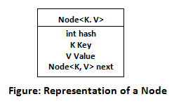

##Hashmap

-----

HashMap is a part of the Java collection framework. 
* It uses a technique called Hashing. 
* It implements the map interface. 
* It stores the data in the pair of Key and Value. 
* HashMap contains an array of the nodes, and the node is represented as a class. 
* It uses an array and LinkedList data structure internally for storing Key and Value. 
* There are four fields in HashMap.

