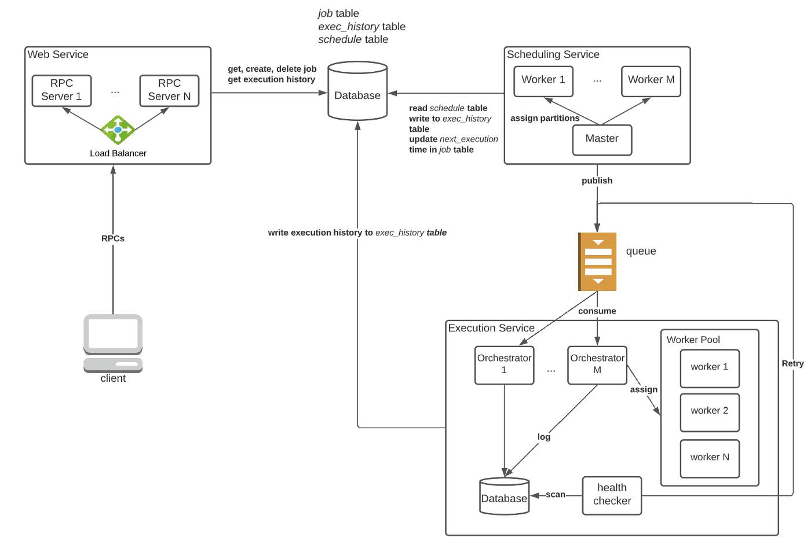

### System Design

## Other Opensource systems
* https://airflow.apache.org/

#### References
https://leetcode.com/discuss/general-discussion/1082786/System-Design%3A-Designing-a-distributed-Job-Scheduler-or-Many-interesting-concepts-to-learn

https://towardsdatascience.com/ace-the-system-design-interview-job-scheduling-system-b25693817950

### Requirements
Core features of job schedulers:

* Create/delete a new job with its schedule
* Query all jobs owned by the user
* Query the status of a job (running, failed, finished, etc)
* Query the execution history of a job
* Retry support for failed tasks
* On-time execution (when a job is scheduled to run at 1 PM, it should be triggered around 1 PM)

Needless to say, the system should be horizontally scalable and highly available.

### Traffic Estimation
we assume the traffic is large for better generalization:
* We expect millions of active users.
* On average, an active user creates a couple of new jobs per week.
* A large percentage of jobs repeat every day for a few times. Some jobs are executed with longer intervals.

Based on the estimations above, we can make the following conclusions:

* The backend database should be horizontally scalable, as the execution history grows quickly (~ 100 million rows of data created every day).
* We need a distributed group of workers to run jobs concurrently with varying capabilities.
* All critical services should be replicated to handle the large traffic.

## High-Level Design

## Architecture

